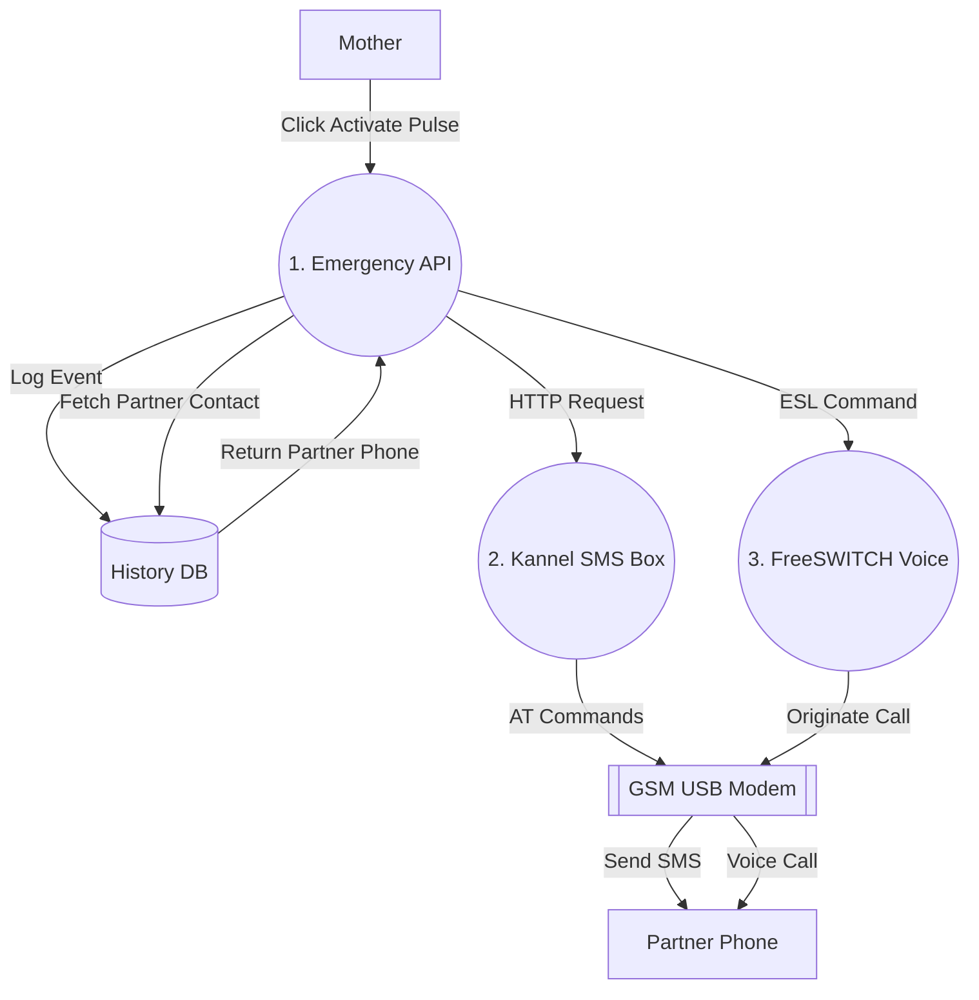

# Data Flow Diagrams (MamaSafe - Kerala Region)
Level 1 of each users DFD (Mother, Partner, Expert, Admin) specifically mapped to the Kerala healthcare ecosystem workflows.

Here are the Level 1 DFDs split up by each specific user role. This makes it much easier to detail the exact processes a specific user interacts with.

You can copy-paste each of these blocks directly into https://mermaid.live/.

1. Mother Role Level 1 DFD
This diagram tracks the flow of how mothers authenticate, input health data, schedule consultations, and read/submit educational content.

mermaid
graph TD
    M[Mother] -->|Enter Credentials| Auth((1. Login Auth))
    M -->|Input Vitals & Mood Images| Health((2. Track Health))
    M -->|Book Consultations| Appt((3. Manage Appts))
    M -->|Submit Sister Story or Read| Content((4. Content System))
    
    Auth -->|Validates & Issues Token| DB[(Database)]
    Health -->|Analyzes using AI & Stores Data| DB
    Appt -->|Saves Selected Schedule| DB
    Content -->|Saves Pending Posts & Reads Published| DB
    
    DB -->|Returns Health Insights| Health
    Health -->|Renders Visual Dashboards| M
    DB -->|Returns Approved Articles| Content
    Content -->|Displays Education Portal| M
2. Partner Role Level 1 DFD
This diagram tracks how the partner interacts with read-only insights, synced from the connected mother's account.

mermaid
graph TD
    P[Partner] -->|Enter Credentials| Auth((1. Login Auth))
    P -->|Request Shared Mother Insights| Health((2. View Health Sync))
    P -->|Request Shared Schedule| Appt((3. View Appointments))
    
    Auth -->|Validates Linked Account Session| DB[(Database)]
    Health -->|Fetch Linked Mother Data| DB
    Appt -->|Fetch Upcoming Consultations| DB
    
    DB -->|Returns Shared Vitals & Alerts| Health
    Health -->|Renders Partner Dashboard| P
    DB -->|Returns Calendar Dates| Appt
    Appt -->|Displays Upcoming Appts| P
3. Medical Expert Role Level 1 DFD
This highlights how healthcare professionals manage their availability, review consented patient histories, and contribute to the educational pool.

mermaid
graph TD
    E[Expert] -->|Enter Credentials| Auth((1. Login Auth))
    E -->|Update Availability Slots| Appt((2. Manage Schedule))
    E -->|Request Patient Details| Consult((3. Review Patient History))
    E -->|Submit Educational Blog/Video| Content((4. Submit Resources))
    
    Auth -->|Validates Session & Role| DB[(Database)]
    Appt -->|Saves Available Times| DB
    Consult -->|Fetch Consented Health Data| DB
    Content -->|Saves Article as Pending| DB
    
    DB -->|Returns Confirmed Bookings| Appt
    Appt -->|Notifies Expert of Appts| E
    DB -->|Returns Past Patient Vitals| Consult
    Consult -->|Displays Patient Profile| E
4. Admin Role Level 1 DFD
This focuses on the administrative actions, which revolve around moderation, onboarding medical experts, and seeing the overall platform state.

mermaid
graph TD
    A[Admin] -->|Secure Credentials| Auth((1. Login Auth))
    A -->|Onboard/Remove Experts| UserMgmt((2. Manage Users))
    A -->|Approve/Reject Pending Posts| Moderation((3. Moderate Content))
    A -->|Request Usage Statistics| Metrics((4. System Analytics))
    
    Auth -->|Validates Admin Token| DB[(Database)]
    UserMgmt -->|Updates Expert Roles/Passwords| DB
    Moderation -->|Updates Post Status to Published| DB
    Metrics -->|Queries Aggregated Logs| DB
    
    DB -->|Returns User Lists| UserMgmt
    UserMgmt -->|Displays Admin Dashboard| A
    DB -->|Fetches Pending Stories| Moderation
    Moderation -->|Displays Content Task List| A
    DB -->|Returns System Data| Metrics
    Metrics -->|Displays Analytic Graphs| A

## 5. Pulse Activation System (Emergency Loop)
This specialized subsystem handles critical safety alerts. When a mother triggers 'Activate Pulse', the system bypasses standard notification queues to ensure immediate delivery via physical hardware.

### Technical Features:
- **Self-Hosted Infrastructure**: Uses Kannel and FreeSWITCH to eliminate dependency on third-party cloud costs.
- **Physical Integration**: Supports direct interfacing with GSM hardware for reliable cellular delivery.
- **High-Fidelity Simulation Mode**: Includes a virtual testing environment that simulates SMS delivery via log-rotation and ESL event trapping, allowing for full architectural validation without hardware.
- **Redundancy**: Concurrent SMS and Voice calls to maximize notification visibility.

